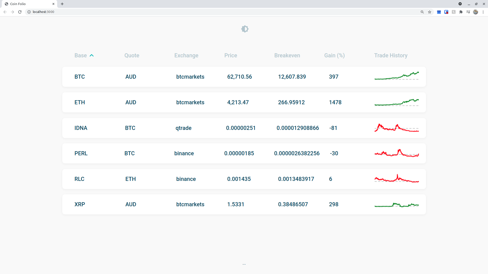

# ccxt-folio

Get an automatic overview of your asset performances on various exchanges, powered by the [ccxt](https://github.com/ccxt/ccxt) unified exchange API.



## Setup

Create a `.env.local` file in the root directory with contents:

```env
DATA_DIR=...
# e.g. DATA_DIR=/home/user/.cache/folio

{EXCHANGE}_PUBLIC_KEY=...
# e.g. BINANCE_PUBLIC_KEY=abc

{EXCHANGE}_PRIVATE_KEY=...
# e.g. BINANCE_PRIVATE_KEY=def

{EXCHANGE}_PAIRS=...
# e.g. BINANCE_PAIRS=ETH/BTC,DOGE/BTC
```

## To-do

-   [ ] Sort out API key storage/access
-   [ ] Retrieve data from ccxt
    -   Currently can get trades, ohlcv 1d and tickers
    -   _future_: only request new data from ccxt by querying cached data for the latest timestamp
-   [ ] Cache data from ccxt
    -   ohlcv and trades stored as .json files
    -   Exchanges and trading pairs stored in .env file
    -   _future_: only sqlite3 database(s)
-   [ ] Reconsider my API implementation (routes, params, etc...)

---

This is a [Next.js](https://nextjs.org/) project bootstrapped with [`create-next-app`](https://github.com/vercel/next.js/tree/canary/packages/create-next-app).

## Getting Started

First, run the development server:

```bash
npm run dev
# or
yarn dev
```

Open [http://localhost:3000](http://localhost:3000) with your browser to see the result.

You can start editing the page by modifying `pages/index.js`. The page auto-updates as you edit the file.

[API routes](https://nextjs.org/docs/api-routes/introduction) can be accessed on [http://localhost:3000/api/hello](http://localhost:3000/api/hello). This endpoint can be edited in `pages/api/hello.js`.

The `pages/api` directory is mapped to `/api/*`. Files in this directory are treated as [API routes](https://nextjs.org/docs/api-routes/introduction) instead of React pages.

## Learn More

To learn more about Next.js, take a look at the following resources:

-   [Next.js Documentation](https://nextjs.org/docs) - learn about Next.js features and API.
-   [Learn Next.js](https://nextjs.org/learn) - an interactive Next.js tutorial.

You can check out [the Next.js GitHub repository](https://github.com/vercel/next.js/) - your feedback and contributions are welcome!

## Deploy on Vercel

The easiest way to deploy your Next.js app is to use the [Vercel Platform](https://vercel.com/new?utm_medium=default-template&filter=next.js&utm_source=create-next-app&utm_campaign=create-next-app-readme) from the creators of Next.js.

Check out our [Next.js deployment documentation](https://nextjs.org/docs/deployment) for more details.
